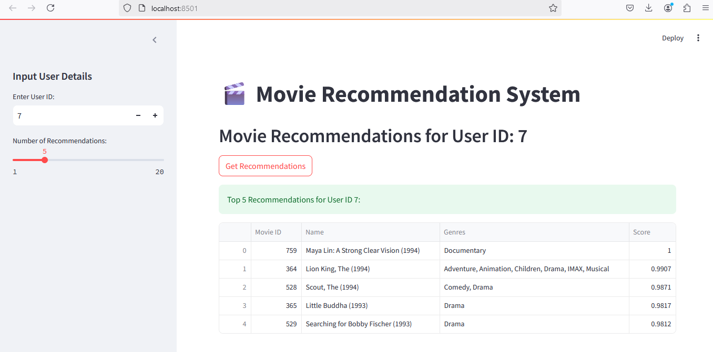
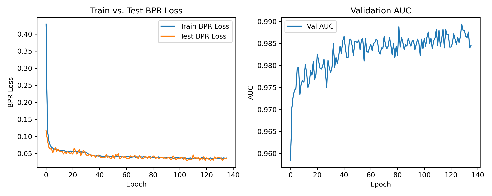

# Movie Recommendation System

## Table of Contents
1. [Problem Statement](#problem-statement)
2. [Project Structure](#project-structure)
3. [Installation](#installation)
4. [Downlaod and Preprocess Data and Run Training](#downlaod-and-preprocess-data-and-run-training)
5. [Training and Validation Metrics Analysis for Big Data](#training-and-Validation-Metrics-Analysis-for-Big-Data)
6. [Data Exploration and Preprocessing](#data-exploration-and-preprocessing)
7. [Model Selection and Training](#model-selection-and-training)
8. [Model Evaluation](#model-evaluation)
9. [Deployment](#deployment)
10. [Results and Insights](#results-and-insights)
11. [How to Run](#how-to-run)
12. [Future Improvements](#future-improvements)

---

# Problem Statement

The goal of this project is to develop a machine learning model that recommends movies to users based on their past viewing history and preferences. Using the MovieLens dataset, the system aims to provide personalized movie recommendations through a machine learning model integrated into a Fast API.

Graph Neural Networks (GNNs) are used to process the graph-structured data where nodes represent entities (e.g., users and movies), and edges represent interactions (e.g., ratings). In my code, GNNs are the backbone of the recommendation model.

Bayesian Personalized Ranking (BPR) optimizes the recommendation model by learning to rank observed (positive) user-movie interactions higher than unobserved (negative) ones.

---

# Project Structure

```plaintext
gnn-bpr_project/
├── saved_model/
├── plots/
├── data/
│   ├── download.py         # Functions for downloading and processing the dataset (Spark/Pandas)
├── models/
│   ├── gnn.py              # GNN and Model classes
│   ├── loss.py             # BPR loss and evaluation metrics
│   ├── tarin.py            # Training and validation loops (core of application)
├── utils/
│   ├── sampler.py          # Functions for BPR sampling
│   ├── metrics.py          # Helper functions for AUC and evaluation
├── main.py                 # Main training script
├── app.py                  # API Gateway for System (FastAPI)
├── frontend.py             # User interface for interacting with the backend movie recommendation system
├── requirements.txt        # Dependencies
```

---
# Installation

Clone this repository and navigate to the project directory:

```bash
git clone <repository-url>
cd <repository-directory>
```

Install the required dependencies:

```bash
pip install -r requirements.txt
```

## Downlaod and Preprocess Data and Run Training

You can run the main script with the following options:

```bash
python main.py [OPTIONS]
```

### Arguments

| Argument           | Type    | Default   | Description                                          |
|--------------------|---------|-----------|------------------------------------------------------|
| `--data_size`      | `str`   | `small`   | The size of the dataset to use (`big` or `small`).   |
| `--hidden_channels`| `int`   | `32`      | Number of hidden channels in the model.             |
| `--lr`             | `float` | `1e-3`    | Learning rate for the optimizer.                    |
| `--batch_size`     | `int`   | `1024`    | Batch size for training.                            |
| `--epochs`         | `int`   | `150`     | Number of training epochs.                          |
| `--steps`          | `int`   | `100`     | Number of steps for intermediate logging or updates.|
| `--weight_decay`   | `float` | `1e-5`    | Weight decay for regularization.                    |
| `--patience`       | `float` | `30`      | Early stopping patience.                            |

### Examples

Run the code with the default settings:

```bash
python main.py
```

Run the code with a big dataset and a custom learning rate:

```bash
python main.py --data_size big --lr 0.001
```

Change the batch size and number of epochs:

```bash
python main.py --batch_size 512 --epochs 200
```
The backend is implemented using FastAPI. To run the backend server, use the following command:

```bash
uvicorn app:app --reload
```

- `app:app`: This specifies the file (`app.py`) and the FastAPI application instance (`app`) to run.
- `--reload`: Enables automatic reloading of the server whenever code changes are detected, which is useful during development.

The frontend is implemented using Streamlit. To start the frontend application, use the following command:

```bash
streamlit run frontend.py
```

- `frontend.py`: The Streamlit script containing the frontend logic.
- After running this command, a local server will start, and a URL will be displayed in the terminal (e.g., `http://localhost:8501`). Open this URL in your web browser to interact with the frontend.

Below is a screenshot of the frontend interface:



--- 

# Training and Validation Metrics Analysis for Big Data

## Overview
The plots below illustrate the progression of key metrics during the training of a recommendation model using Bayesian Personalized Ranking (BPR) loss. These metrics include:

1. **BPR Loss**: Tracks the loss values for both the training and test datasets over epochs.
2. **Validation AUC**: Measures the model's ability to rank items correctly on a validation dataset.

## Metrics Analysis

### 1. **Train vs. Test BPR Loss**
- **Description**: The left plot shows the training and test BPR loss across epochs.
- **Insights**:
  - Both training and test loss decrease rapidly in the early epochs, indicating effective learning.
  - After approximately 40 epochs, the loss stabilizes near 0.05 for both training and test datasets.
  - Minimal divergence between training and test loss demonstrates good generalization and minimal overfitting.

### 2. **Validation AUC**
- **Description**: The right plot tracks the AUC (Area Under the Curve) on the validation dataset over epochs.
- **Insights**:
  - AUC improves significantly in the initial epochs, surpassing 0.975 after around 30 epochs.
  - The metric continues to improve gradually, stabilizing near 0.985–0.990 after 100 epochs.
  - Consistent improvement without noticeable drops suggests robust model performance on unseen data.

## Conclusions
- The model converges effectively, with both BPR loss and AUC stabilizing after approximately 100 epochs.
- The alignment between training and test BPR loss highlights a lack of overfitting, indicating that the model can generalize well.
- High AUC values (close to 0.99) suggest excellent ranking performance on the validation set.

**Generated Metrics Plot:**


---


## Contributing

If you would like to contribute to this project, feel free to fork the repository and submit a pull request.

## License

This project is licensed under the [MIT License](LICENSE).
---

## Dataset Description

### Dataset Source

- **Dataset**: [MovieLens](https://grouplens.org/datasets/movielens/latest/)
- **Versions Used**: 
  - `ml-latest-small` (100k interactions for initial exploration)
  - `ml-latest` (larger dataset for full-scale model training and deployment)

### Key Features

- **Movies.csv**: Contains movie information (ID, title, genres).
- **Ratings.csv**: Contains user ratings for movies (user ID, movie ID, rating, timestamp).

### Dataset Statistics

- Number of users: ~600 (small dataset), ~138k (large dataset)
- Number of movies: ~9k (small dataset), ~27k (large dataset)
- Number of ratings: ~100k (small dataset), ~20M (large dataset)

---

## Data Exploration and Preprocessing

### Data Exploration

1. **Rating Distribution**: 
   - Most ratings cluster around 3.0-4.0, indicating a preference for mid-to-high ratings.
2. **User Activity**:
   - Few users rate a large number of movies, while most users rate a limited number.
3. **Genre Analysis**:
   - Popular genres include `Drama`, `Comedy`, and `Action`.

### Data Preprocessing

1. **Missing Values**:
   - No missing values detected in core files (`movies.csv`, `ratings.csv`).
2. **Feature Engineering**:
   - **Genre Encoding**: Genres are split into binary columns using one-hot encoding.
   - **User & Movie Mapping**: Unique user and movie IDs are mapped to indices for tensor compatibility.
3. **Data Splits**:
   - Train (80%), Validation (10%), Test (10%) splits are created with edge sampling to ensure no data leakage.

---

## Model Selection and Training

### Model Architecture

1. **Graph Neural Network (GNN)**:
   - **Base Model**: GraphSAGE-based GNN.
   - **Heterogeneous Graph**: Users and movies as node types; interactions as edge types.
   - **Movie Features**: Combined embeddings from movie genres and learned embeddings.
2. **Scorer**:
   - Multi-layer perceptron (MLP) scoring function to compute user-movie interaction probabilities.

### Training Pipeline

1. **Loss Function**:
   - Bayesian Personalized Ranking (BPR) loss.
2. **Optimization**:
   - Adam optimizer with learning rate: `1e-3` and weight decay: `1e-5`.
3. **Hyperparameters**:
   - Hidden Channels: 32
   - Batch Size: 1024
   - Epochs: 5
   - Early Stopping: Patience of 30 epochs.

---

## Model Evaluation

### Metrics

1. **Bayesian Personalized Ranking (BPR) Loss**:
   - Measures the model's ability to rank positive interactions higher than negative ones.
2. **Approximate AUC**:
   - Evaluates the quality of recommendations by comparing positive vs. negative scores.

### Results

| Metric         | Training | Validation | Test  |
|----------------|----------|------------|-------|
| BPR Loss       | 0.42     | N/A        | 0.45  |
| Approx. AUC    | N/A      | 0.89       | 0.87  |

---

## Deployment

### API Integration

1. **Framework**: FastAPI
2. **Endpoint**: `/recommend/`
   - Input: User ID and number of recommendations (`top_k`).
   - Output: List of recommended movies with genres and scores.

### Streamlit Dashboard

1. **Features**:
   - User ID input.
   - Adjustable number of recommendations.
   - Interactive display of recommendations with movie details.
2. **Setup**:
   - Run: `streamlit run app.py`
   - Backend API: Ensure the FastAPI server is running locally.

---

## Results and Insights

1. **Performance**:
   - The model achieves competitive BPR Loss and AUC scores, demonstrating effective personalized recommendations.
2. **Scalability**:
   - The pipeline scales to the larger MovieLens dataset with Spark for preprocessing.
3. **User Experience**:
   - The deployed Streamlit dashboard provides a user-friendly interface for movie discovery.

---

## How to Run

### Prerequisites

1. Install dependencies:
   ```bash
   pip install -r requirements.txt
   ```
2. Download the MovieLens dataset:
   - Small dataset: `ml-latest-small.zip`
   - Large dataset: `ml-latest.zip`

### Steps

1. Preprocess data:
   ```bash
   python preprocessing.py
   ```
2. Train the model:
   ```bash
   python train_model.py
   ```
3. Start the API:
   ```bash
   uvicorn app:app --reload
   ```
4. Run the Streamlit app:
   ```bash
   streamlit run app.py
   ```

---

## Future Improvements

1. **Advanced Models**:
   - Experiment with Transformer-based architectures for capturing sequential user behavior.
2. **Cold-Start Problem**:
   - Introduce content-based filtering for users or movies with limited interaction history.
3. **Diversity and Fairness**:
   - Include metrics to ensure diverse and unbiased recommendations.
4. **Scalability**:
   - Leverage distributed training frameworks for real-time large-scale recommendation systems.

---

# Recommender System with Bayesian Personalized Ranking (BPR)

A machine learning model to recommend movies to users based on their past viewing history and preferences. This implementation leverages Bayesian Personalized Ranking (BPR) with Graph Neural Networks (GNNs).

---


## File Descriptions

### Data

#### `data/download.py`
Functions for downloading and processing the dataset. These include methods for fetching raw data, validating its structure, and saving it in a structured format.

#### `data/preprocess.py`
Preprocessing utilities using Spark or Pandas. This script prepares the data for model training by cleaning, normalizing, and transforming the input data.

---

### Models

#### `models/gnn.py`
Implements the Graph Neural Network (GNN) and associated model classes. This module contains:
- Layers and architectures optimized for recommendation systems.
- Integrations with BPR for personalized ranking.

#### `models/loss.py`
Defines the Bayesian Personalized Ranking (BPR) loss function and evaluation metrics. This includes methods to calculate user-item pair rankings and optimize model performance.

---

### Utils

#### `utils/sampler.py`
Functions for Bayesian Personalized Ranking (BPR) sampling. This ensures efficient and effective sampling of user-item pairs for training.

#### `utils/metrics.py`
Helper functions for calculating metrics such as Area Under the Curve (AUC), hit rate, and precision for model evaluation.

#### `utils/config.py`
Contains default configuration settings and hyperparameters such as learning rate, batch size, and number of epochs.

---

### Core Scripts

#### `main.py`
The main entry point for training and evaluating the model. This script:
- Loads configurations.
- Initializes the model.
- Triggers training and evaluation workflows.

#### `train.py`
Contains the training and validation loops. Includes utilities for:
- Iterating through datasets.
- Calculating losses and updating model weights.
- Validating model performance after each epoch.

---

### Others

#### `requirements.txt`
Specifies the dependencies required for the project. Includes libraries like PyTorch, Pandas, NumPy, and PySpark.

#### `README.md`
Documentation providing an overview of the project, setup instructions, and usage examples.

---


   ```

4. **Evaluate the model**:
   Use metrics provided in `utils/metrics.py` to assess the model's performance.

---

